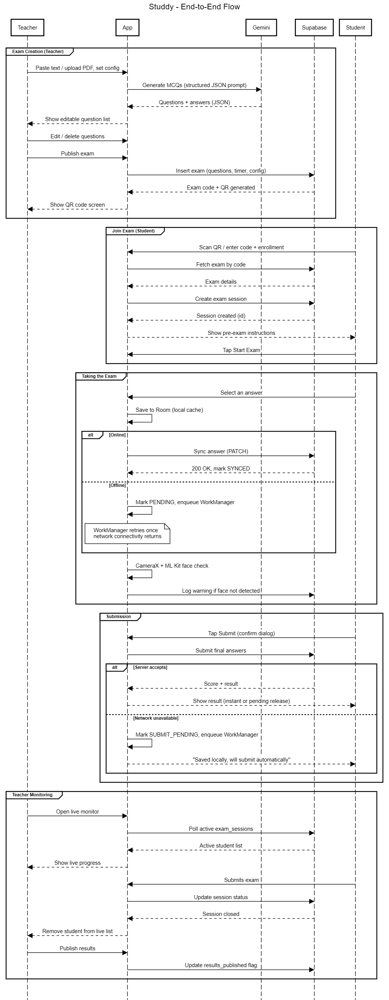
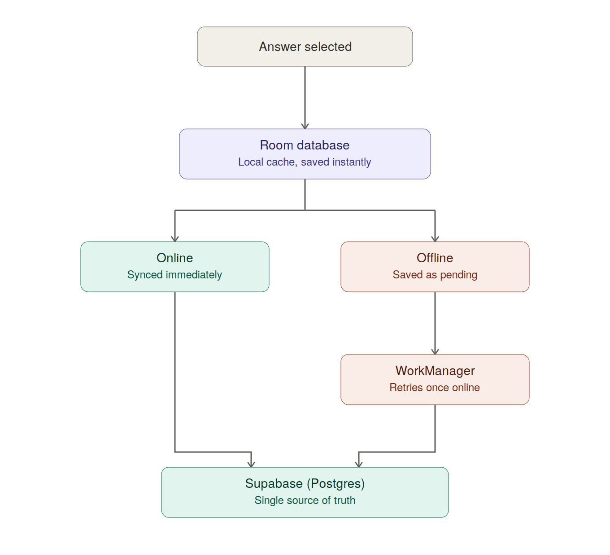

# Studdy 🎓 — Smart AI-Assisted Examination Platform

[](https://developer.android.com/)
[](https://www.oracle.com/java/)
[](https://supabase.com/)
[](https://deepmind.google/technologies/gemini/)

**Studdy** is a two-sided, AI-assisted examination platform built natively for Android. It enables teachers to instantly author exams from syllabus text or PDFs using Google's Gemini AI, monitor student participation in real time with anti-cheat telemetry, and export paper assets. Students can join exams via simple codes or QR scans, attempt exams offline, and sync their progress seamlessly.

---

## 🏛️ System Architecture & App Flow

To help recruiters and engineers understand how the entire ecosystem interacts, we have mapped out the entire lifecycle of an exam—from teacher authentication and AI question generation to student execution and proctoring.

### 🔄 End-to-End Application Flow

Below is the complete sequence flow showcasing how data moves between the Teacher Client, Student Client, Supabase Database, Supabase Auth, and the Gemini AI API:



---

## 💾 Offline-First Sync Architecture

Studdy is designed with reliability in mind, particularly for educational environments with unstable internet connections. The application employs an **Offline-First Sync Engine** combining a local **Room Database cache** with **Android WorkManager** and **Supabase Realtime/REST APIs**.



### Sync Mechanics:
1. **Instant Saves:** Every student answer selection is written instantly to the local Room database cache. This prevents data loss if the app crashes, is backgrounded, or if the device runs out of battery.
2. **Immediate Sync:** If a connection is active, the answer is immediately pushed to the remote Supabase database.
3. **Queueing & Retrying:** If the device goes offline, the sync task is added to a local queue. Android's `WorkManager` monitors network connectivity and automatically triggers a background sync job to flush queued answers to Supabase once connectivity is restored.
4. **Single Source of Truth:** Supabase remains the ultimate source of truth, but the client functions seamlessly without a constant network connection.

---

## 🛠️ Key Features & Technical Highlights

### 👨‍🏫 Teacher Portal
- **AI Exam Generation:** Generate objective Multiple Choice Question (MCQ) exams instantly by pasting reference text or uploading/parsing PDF documents. Powered by **Google Gemini API**.
- **Real-Time Proctoring & Monitoring:** Track student participation, progress, and cheat-telemetry in real time.
- **Printable Exam Creator:** Create, edit, and export beautifully formatted multi-section printable exam papers (supporting MCQs, short/long answers, true/false, fill-in-the-blanks) complete with printable PDF exports and answer keys.
- **Flexible Exam Configurations:** Set exam timers (no timer, per-attempt duration, or fixed calendar windows) and toggle result visibility modes (instant automatic scoring vs. manual release).
- **Secure Authentication:** Built using **Supabase Auth** (Email/Password) with full session restoration and password-reset capability.

### 🧑‍🎓 Student Portal
- **Anonymous Entry:** Students join exams instantly using their Name and Enrollment Number via a 6-character Code or QR scan (no password required).
- **Smooth Exam Experience:** Clear UI showing time remaining, progress indicators, and option selectors.
- **Cheat Telemetry (Proctoring):** Lightweight anti-cheat monitoring. It automatically detects and logs window blurs, backgrounding, tab switches, or screen locks, reporting these events as telemetry to the Teacher's monitoring dashboard.
- **Progress Preservation:** Answers are preserved across sessions so students can resume an exam if their app is closed.

---

## 💻 Tech Stack & Native Implementation

* **UI Framework:** Native Android XML, Custom layouts with material styling.
* **Programming Language:** Java (clean OOP architecture, async task management).
* **Local Database:** Room Persistence Library (SQLite abstraction).
* **Background Processing:** Android WorkManager (handles robust background synchronization).
* **Backend BaaS:** Supabase (Auth, PostgreSQL Database, REST API, Realtime WebSockets).
* **AI Integration:** Gemini API (direct REST integration using system prompts for strict JSON schema output).
* **Networking & JSON Parsing:** OkHttp & Gson.
* **PDF Utility:** Native `PdfDocument` API for rendering and exporting printable exam papers.
* **Barcode/QR Utility:** ZXing (Zebra Crossing) for scanning and generating QR codes.

---

## 🗄️ Database Schema Design (Supabase)

Studdy uses a PostgreSQL 17 database hosted on Supabase. The database contains five primary tables:

1. **`public.exams`**: Stores MCQ exams created by teachers. Includes fields for `code`, `title`, `questions` (JSONB format), `result_mode` (instant/manual), `timer_mode`, `duration_minutes`, and `window_start`/`window_end` constraints.
2. **`public.students`**: Stores student identity metadata (unauthenticated/anonymous row containing `enrollment_number` and `name`).
3. **`public.results`**: Logs overall student scores, timestamps, and proctoring telemetry summaries.
4. **`public.exam_sessions`**: Stores live student answer states to facilitate progress resumption and offline reconciliation.
5. **`public.generated_papers`**: Stores printable/offline exam papers and their metadata.

---

## 🚀 Setting Up the Project

### Prerequisites
- Android Studio Ladybug (or newer)
- JDK 17
- A Supabase Project
- A Gemini API Key

### Configuration
1. Clone the repository:
   ```bash
   git clone https://github.com/bhoraniaarshadali/studdy-ai-android-only.git
   ```
2. Open the project in Android Studio.
3. Create a `local.properties` file in the root directory (never commit this file) and populate it with your API keys:
   ```properties
   # Supabase Configuration
   SUPABASE_URL=https://your-project-id.supabase.co
   SUPABASE_ANON_KEY=your-supabase-anon-key
   
   # Google Gemini AI Configuration
   GEMINI_API_KEY=your-gemini-api-key
   ```
4. Build and run the project on your device or emulator.
